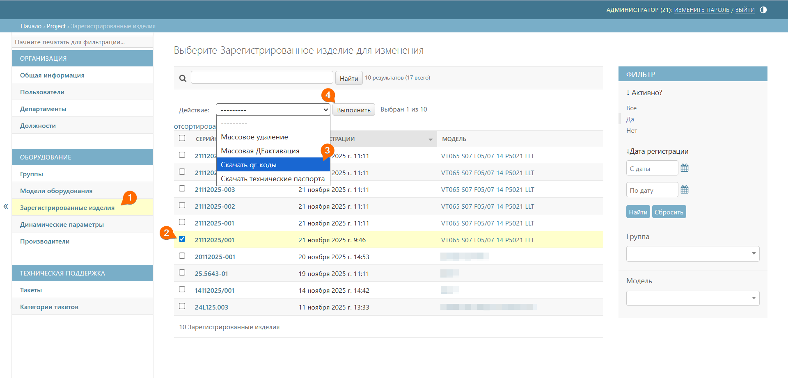
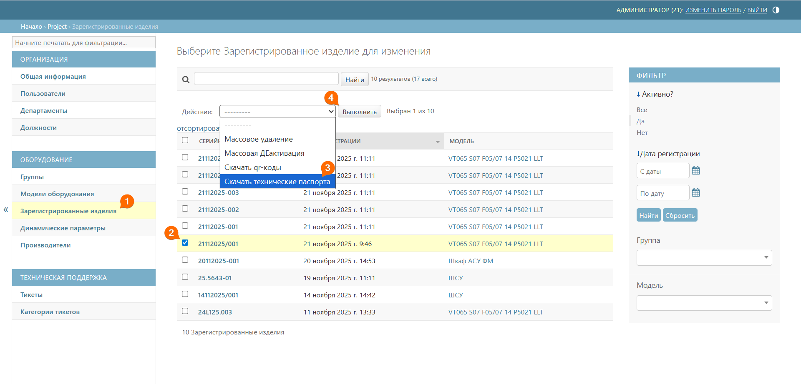

# Зарегистрированные изделия
Подраздел **Зарегистрированные изделия** предназначен для отображения списка зарегистрированных изделий в QR-Passport. 

## Описание главного окна

Таблица зарегистрированных изделий содержит следующие колонки:
* _серийный номер_ – уникальный идентификатор изделия (выше по наименованию этой колонки осуществляется поиск изделий);
* _дата регистрации_ – дата и время добавления изделия в систему (справа доступна фильтрация по дате регистрации);
* _модель_ – модель оборудования, к которой относится изделие (справа доступна фильтрация по моделям оборудования).

## Просмотр детальной информации
Для просмотра полной информации об изделии необходимо выбрать соответствующую запись из общего списка.

При нажатии на серийный номер осуществляется переход в карточку изделия, где доступны следующие блоки информации:
* _общая информация по изделию_ – модель и срок дополнительной гарантии;



При необходимости можно добавить для выбранного изделия дополнительную гарантию. Для этого нужно нажать кнопку **Редактировать** и ввести количество месяцев дополнительной гарантии.



* _динамические параметры_ – заполненные динамические параметры этого изделия;
* _документы для изделий_ – индивидуальные документы изделия (при наличии).

## Скачивание QR-кода/QR-кодов
Для скачивания QR-кода выполните следующие шаги:
1. Перейдите к подразделу **Зарегистрированные изделия**
2. С помощью галочек выберите нужное количество изделий
3. В выпадающем списке выберите **Скачать QR-коды**
4. Нажмите кнопку **Выполнить**







Чтобы выбрать несколько изделий подряд, кликните на галочку напротив серийного номера первого изделия, затем зажмите Shift и кликните на последний – все промежуточные элементы выделятся автоматически.



5. В выпадающем окне выберите формат этикетки: квадрат или прямоугольник 
6. Выберите размер этикетки или введите свое значение
7. Нажмите кнопку **Скачать QR-код**





## Скачивание паспорта/паспортов
Для скачивания QR-кода выполните следующие шаги:
1. Перейдите к подразделу **Зарегистрированные изделия**
2. С помощью галочек выберите нужное количество изделий
3. В выпадающем списке выберите **Скачать технические паспорта**
4. Нажмите кнопку **Выполнить**




