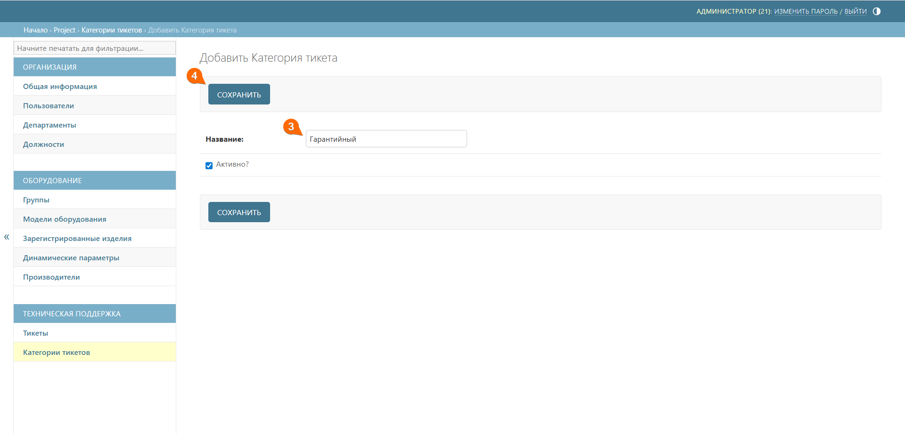

# Категории тикетов
Подраздел **Категории тикетов** предназначен для создания тематических категорий для сортировки обращений. Группировка запросов помогает быстрее распределять их между специалистами.

## Создание категории тикета
Для создания новой категории тикета выполните следующие шаги:
1. Перейдите к подразделу **Категории тикетов**
2. Нажмите кнопку **Добавить категорию тикета** 





3. Добавьте название категории тикета
4. Нажмите кнопку **Сохранить**



